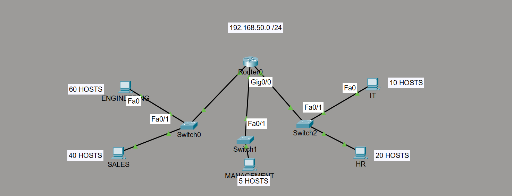
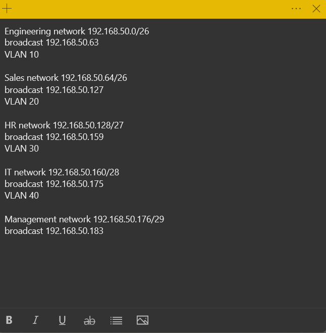
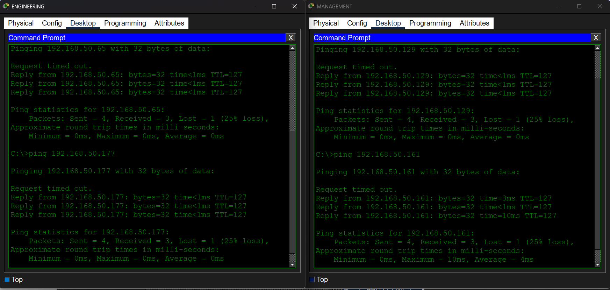

# Enterprise Network Segmentation Lab

## Overview

This project simulates a small enterprise network where multiple departments require their own network segments while still allowing communication between them.

The network was designed using VLSM subnetting, VLAN segmentation, and router-on-a-stick inter-VLAN routing.

## Technologies Used

- Cisco Packet Tracer
- VLAN configuration
- Router subinterfaces
- VLSM subnetting
- Inter-VLAN routing

## Department Requirements

| Department | Hosts |
|------------|-------|
| Engineering | 60 |
| Sales | 40 |
| HR | 20 |
| IT | 10 |
| Management | 5 |

## Subnet Plan

| Department | Network | Mask | Broadcast |
|------------|--------|------|-----------|
| Engineering | 192.168.50.0 | /26 | 192.168.50.63 |
| Sales | 192.168.50.64 | /26 | 192.168.50.127 |
| HR | 192.168.50.128 | /27 | 192.168.50.159 |
| IT | 192.168.50.160 | /28 | 192.168.50.175 |
| Management | 192.168.50.176 | /29 | 192.168.50.183 |

## Network Topology

## Subnet Design Notes

## Connectivity Verification

Successful inter-VLAN communication was verified using ICMP ping tests between departments.

## Skills Demonstrated

- Network design
- VLAN configuration
- Router-on-a-stick
- VLSM subnetting
- Network troubleshooting

## How to Run This Lab

1. Download the Packet Tracer file.
2. Open it in Cisco Packet Tracer.
3. Use CLI to view router and switch configurations.

Example commands:

show vlan brief

show ip interface brief

show running-config